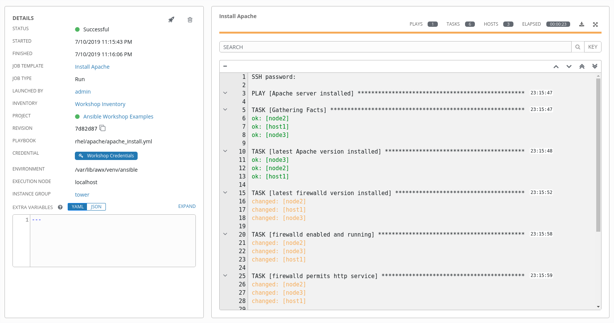

# Workshop Exercise - Projects & job templates

## Table Contents

* [Objective](#objective)
* [Guide](#guide)
* [Setup Git Repository](#setup-git-repository)
* [Create the Project](#create-the-project)
* [Create a Job Template and Run a Job](#create-a-job-template-and-run-a-job)


# Objective

An Ansible Tower **Project** is a logical collection of Ansible Playbooks. You can manage your playbooks by placing them into a source code management (SCM) system supported by Tower, including Git, Subversion, and Mercurial.

This exercise covers
- Understanding and using an Ansible Tower Project
- Using Ansible Playbooks kept in a Git repository.
- Creating and using an Ansible Job Template

# Guide

## Setup Git Repository

For this demonstration we will use playbooks stored in a Git repository:

**https://github.com/ansible/workshop-examples**


A Playbook to install the Apache web server has already been committed to the directory **rhel/apache**, `apache_install.yml`:

```yaml
---
- name: Apache server installed
  hosts: all

  tasks:
  - name: latest Apache version installed
    yum:
      name: httpd
      state: latest

  - name: latest firewalld version installed
    yum:
      name: firewalld
      state: latest

  - name: firewalld enabled and running
    service:
      name: firewalld
      enabled: true
      state: started

  - name: firewalld permits http service
    firewalld:
      service: http
      permanent: true
      state: enabled
      immediate: yes

  - name: Apache enabled and running
    service:
      name: httpd
      enabled: true
      state: started
```

> **Tip**
>
> Note most importantly there is no `become` and `hosts` is set to `all`.

To configure and use this repository as a **Source Control Management (SCM)** system in Tower you have to create a **Project** that uses the repository

## Create the Project

  - Go to **RESOURCES → Projects** in the side menu view click the green **+**  button. Fill in the form:

  <table>
    <tr>
      <th>Parameter</th>
      <th>Value</th>
    </tr>
    <tr>
      <td>NAME</td>
      <td>Ansible Workshop Examples</td>
    </tr>
    <tr>
      <td>ORGANIZATION</td>
      <td>Default</td>
    </tr>
    <tr>
      <td>SCM TYPE</td>
      <td>Git</td>
    </tr>
  </table>

 Enter the URL into the Project configuration:

 <table>
   <tr>
     <th>Parameter</th>
     <th>Value</th>
   </tr>
   <tr>
     <td>SCM URL</td>
     <td><code>https://github.com/ansible/workshop-examples.git</code></td>
   </tr>
   <tr>
     <td>SCM UPDATE OPTIONS</td>
     <td>Tick the first three boxes to always get a fresh copy of the repository and to update the repository when launching a job</td>
   </tr>
 </table>

- Click **SAVE**


The new Project will be synced automatically after creation. To view ouput for **Projects**, click the green circle next to the Project name.


## Create a Job Template and Run a Job

A job template is a definition and set of parameters for running an Ansible job. Job templates are useful to execute the same job many times. So before running an Ansible **Job** from Tower you must create a **Job Template** that pulls together:

- **Inventory**: On what hosts should the job run?

- **Credentials** What credentials are needed to log into the hosts?

- **Project**: Where is the Playbook?

- **What** Playbook to use?

Okay, let’s just do that: Go to the **Templates** view, click the  button and choose **Job Template**.

> **Tip**
>
> Remember that you can often click on magnfying glasses to get an overview of options to pick to fill in fields.

<table>
  <tr>
    <th>Parameter</th>
    <th>Value</th>
  </tr>
  <tr>
    <td>NAME</td>
    <td>Install Apache</td>
  </tr>
  <tr>
    <td>JOB TYPE</td>
    <td>Run</td>
  </tr>
  <tr>
    <td>INVENTORY</td>
    <td>Workshop Inventory</td>
  </tr>
  <tr>
    <td>PROJECT</td>
    <td>Ansible Workshop Examples</td>
  </tr>
  <tr>
    <td>PLAYBOOK</td>
    <td><code>rhel/apache/apache_install.yml</code></td>
  </tr>    
  <tr>
    <td>CREDENTIAL</td>
    <td>Workshop Credentials</td>
  </tr>
  <tr>
    <td>LIMIT</td>
    <td>web</td>
  </tr>    
  <tr>
    <td>OPTIONS</td>
    <td>tasks need to run as root so check **Enable privilege escalation**</td>
  </tr>           
</table>

- Click **SAVE**

You can start the job by directly clicking the blue **LAUNCH** button, or by clicking on the rocket in the Job Templates overview. After launching the Job Template, you are automatically brought to the job overview where you can follow the playbook execution in real time:



Since this might take some time, have a closer look at all the details provided:

- All details of the job template like inventory, project, credentials and playbook are shown.

- Additionally, the actual revision of the playbook is recorded here - this makes it easier to analyse job runs later on.

- Also the time of execution with start and end time is recorded, giving you an idea of how long a job execution actually was.

- On the right side, the output of the playbook run is shown. Click on a node underneath a task and see that detailed information are provided for each task of each node.

After the Job has finished go to the main **Jobs** view: All jobs are listed here, you should see directly before the Playbook run an SCM update was started. This is the Git update we configured for the **Project** on launch\!

----
**Navigation**
<br>
[Previous Exercise](../2.2-cred) - [Next Exercise](../2.4-surveys)

[Click here to return to the Ansible for Red Hat Enterprise Linux Workshop](../README.md#section-2---ansible-tower-exercises)
